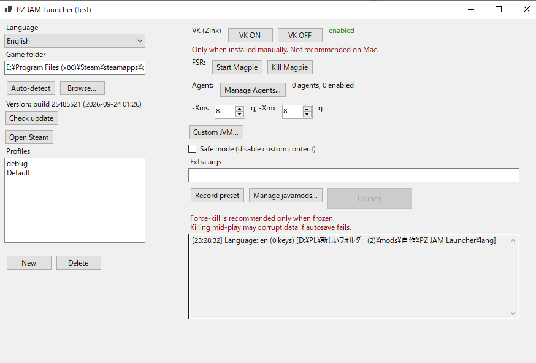

# PZ JAM Launcher


**Windows launcher for Project Zomboid that simplifies JavaAgent mod installation and manages mod/JVM settings as profiles.**

**⚠ No compatibility with macOS or Linux.**

> 日本語版: [README.ja.md](README.ja.md)

## Screenshots



## Features

- **JavaAgent mods**: multi-agent `-javaagent` composition with per-agent gates (`strict` / `lenient` / `none`), revision checks, SHA-256 logging
- **javamod check/approval flow**: per-agent SHA-256 verification at launch. First-seen jars need approval, changed jars abort the launch with a report dialog and need approval on next launch, missing jars abort and are removed from the list
- **Profiles**: save/select launch configs (agents, JVM, args). Launch button locks until a profile is selected
- **JVM**: numeric `-Xms`/`-Xmx`, custom JVM window, safe mode
- **Safety**: force-kill with freeze-only warning, duplicate-launch guard
- **i18n**: English default + 7 translations via `lang/*.json` (see [lang/KEYS.md](lang/KEYS.md) to contribute)

### Optional (manual install required, not included)

- **VK mode (Mesa Zink)**: OpenGL-over-Vulkan rendering. Works only if you installed Mesa yourself
- **FSR scaling (Magpie)**: start/kill Magpie from the launcher. Works only if you installed Magpie yourself

Setup: [EXTERNAL-TOOLS.md](EXTERNAL-TOOLS.md).

## Quick Start

1. Download `PZJAMLauncher.exe` and `lang/` from [Releases](releases) (no install, no runtime needed)
2. Run `PZJAMLauncher.exe` → game folder is auto-detected → create a profile → **Launch**

> Steam must be running for Workshop mods. The launcher never modifies your saves or mod enable-lists.

Details: [Tutorial](TUTORIAL.md).

## Requirements

- Windows 10 64-bit, Steam version of Project Zomboid (B42)
- Admin rights (only when placing files under Program Files)

## Usage

Basic flow is covered above. Detailed tutorials will be published separately.

## Build from source

```powershell
dotnet publish -c Release -r win-x64 --self-contained true `
  -p:PublishSingleFile=true -p:IncludeNativeLibrariesForSelfExtract=true -o out
```

Requires [.NET 8 SDK](https://dotnet.microsoft.com/download/dotnet/8.0). Sources are in `src/`.

## FAQ

- **Workshop mods missing?** Start the Steam client first. Direct-java launches don't start Steam by themselves.
- **Shows D3D12 instead of Zink?** Either Mesa isn't installed correctly, or you left VK ON in the launcher, quit it, then started the game from elsewhere (Steam / ProjectZomboid64.exe) without `GALLIUM_DRIVER=zink` reaching the process. Mesa without the variable falls back to D3D12. Fix: launch with VK ON from this launcher, or set the variable system-wide (see guide).
- **Magpie won't scale?** Magpie needs manual install. Use windowed (not borderless/exclusive fullscreen) game + lower in-game resolution.
- **Agent excluded (rev ...)?** Revision gate. Rebuild the agent for the current game rev.

## Contributing

- Translations: copy `lang/KEYS.md` table into `lang/<code>.json` (UTF-8) and open a PR
- Bugs: open an Issue with the launcher log + relevant `console.txt` lines (`GraphicsCard`, JavaMod loading parts, and other launcher-feature-related lines)

## License

MIT — see [LICENSE](LICENSE) for details.
