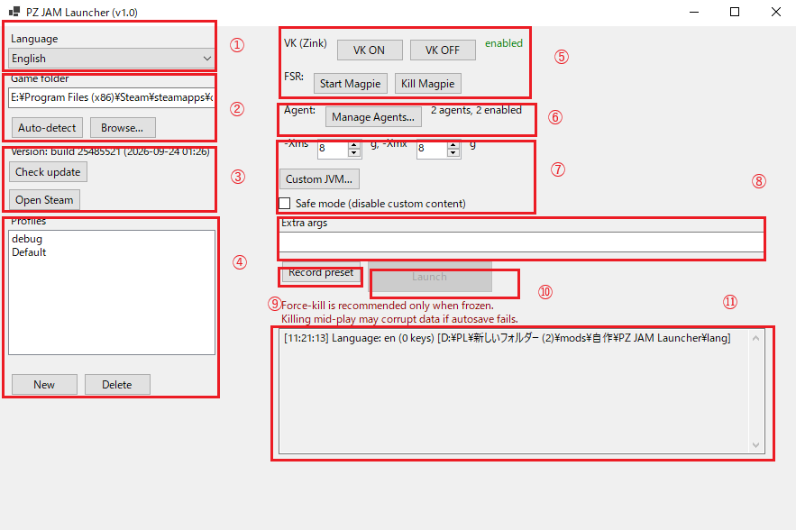
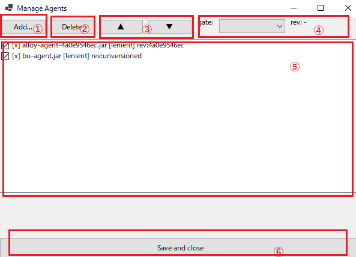
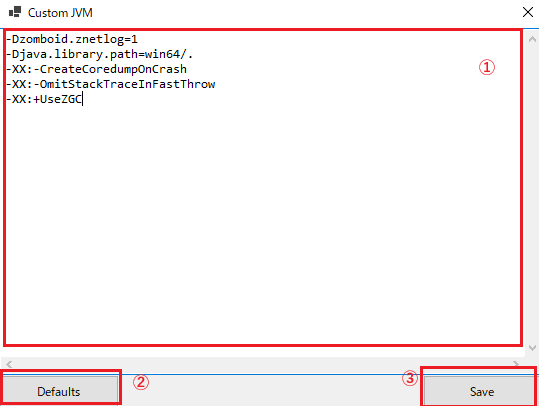

# PZ JAM Launcher Tutorial

> Screenshots are placeholders (`docs/tutorial-*.png`). Text first.

## 0. Screen overview

### Main window



1. **Language tab.** **APPLIES AFTER RESTART** (restart required).
2. **Game folder.** Auto-detected. Set manually if not found or wrong.
3. **Game version + Steam buttons.** Version shows the build number. Check update compares against the latest stable — beware if you run another branch.
4. **Profile list** + New / Delete selected profile.
5. **External tools (Zink/Magpie)** helpers.
6. **Agent mod settings.**
7. **JVM settings area.**
8. **Extra args input.** Launch flags like `-debug` on Steam go here.
9. **Record preset** (save profile settings).
10. **Launch / Kill button.**
11. **Launcher log.**

### Agent mod settings window



1. **Add** an agent mod: specify the target `.jar`.
2. **Delete** the selected agent mod from the list.
3. **Reorder** the selected agent mod in the list (composition order).
4. **Gate setting**: match the agent's built-in game version against the game version, then exclude, warn-only, or allow.
5. **Agent mod list.**
6. **Save settings.**

### Custom JVM window



1. **JVM input field.**
2. **Reflects PZ stock state.** Overwrites existing input, so beware.
3. **Save input.**

## 1. Language

1. Open the **Language** dropdown (top left)
2. Select your language → restart the launcher to apply

## 2. Profiles

1. Click **New**, enter a name (e.g. `Default`), then select it in the list
2. The **Launch** button unlocks once a profile is selected
3. After editing anything, click **Record preset** to save it into the profile

## 3. Xms / Xmx

1. Set `-Xms` / `-Xmx` numbers above the **Custom JVM...** button (min 3GB, blank = 3)
2. Keep `Xms <= Xmx`; the launcher clamps automatically

## 4. Custom JVM

1. Click **Custom JVM...** → edit flags, one per line → **Save**
2. **Defaults** overwrites the box with the stock configuration (not appended)
3. In **Safe mode** (checkbox below), custom content is ignored

No need to write these (already added by the launcher):
`-Djava.awt.headless`, `--enable-native-access`, `--add-exports`, `-Dzomboid.steam`,
`-Xms/-Xmx` (numeric fields), `-Djava.library.path`, `-cp`/`MainScreenState`,
`-agentlib:zbNative` (only if present).

Example: converting the stock `ProjectZomboid64.json` (preset 4 era):
```
-Dzomboid.znetlog=1
-Djava.library.path=win64/.
-XX:-CreateCoredumpOnCrash
-XX:-OmitStackTraceInFastThrow
-XX:+UseZGC
```
(Base 4 lines and `-Xmx` excluded — covered by launcher/numeric fields.)

## 5. Agent mods

### Adding

1. Click **Manage Agents...** → **Add...**
2. Browse to the `.jar` location (e.g. inside the Workshop mod folder) and select it
3. The launcher sets `-javaagent:<that path>` automatically at launch. Check the row to enable → **Save and close**

> **⚠ Use only Agent mods you trust. Using unchecked suspicious mods is at your own risk.**

### Gates (per row)

The gate compares the agent's built-in revision against the game revision:

- `strict`: excluded on mismatch **or** unknown rev. Use when the author guarantees version match
- `lenient`: warns on mismatch but continues. Missing rev is allowed. Default for mods that don't use game APIs
- `none`: existence check only

Mismatch/warn/excluded reasons appear per row in the launch log. In **Safe mode** all agents are excluded.

## 6. Launch

1. Select a profile → **Launch**
2. While running, the button becomes **Kill** (use only when frozen; mid-play kills may corrupt saves)
3. After the game exits, the button returns to **Launch**
